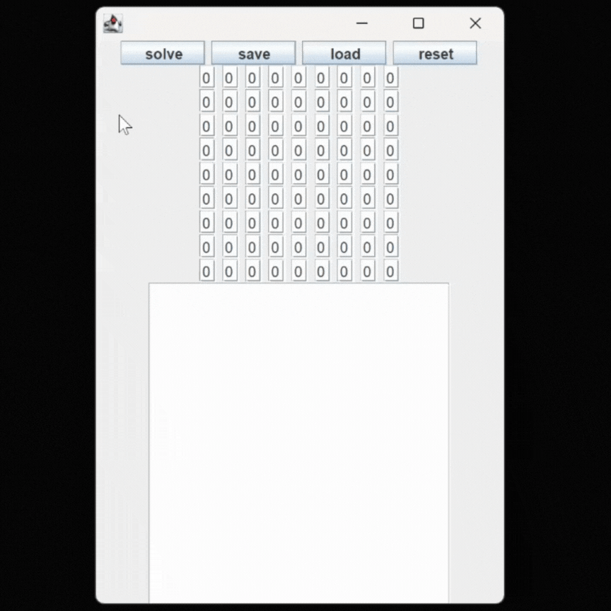

Application designed to solve 9x9 sudoku through a brute force algorithm approach based on the traversing of a doubly linked list formed by nodes representing the unknown numbers.

Once the known numbers have been added, hitting the "solve" button will start the algorithm:
- step 1: increment by 1 the first 0 (first unknown value, typically on the top left part of the sudoku).
- step 2: check if the resulting number
  - is legal -> repeat step 1 on the next unknown number.
  - is not legal but lower than 10 -> repeat step 1 on the same number.
  - is not legal as equal to 10 -> set it to 0 and repeat step 1 for the previous number.
- step 3: the process will end either setting the first number to 0 (no solution available) or finding the last (typically on the bottom right part if the sudoku) legal number     (solution found) and the result will be displayed.

In order to start the application, compile and run the SudokuSolverLauncher.java file.

  

